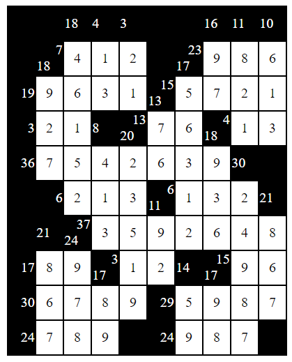

# SolveKakuro
A solver for kakuro number puzzles written in F#. The code aims to be brief, and simple. It iterates through every possibility for filling in the board depth first, but detects fairly early when a path of the search cannot lead to a solution. Despite the brute force nature of the algorithm, solve times are under a second.

## Input Files
The solver is currently is hardcoded for 9x9 Kakuros (10x10 including the left and top borders, which can only contain totals, not fillable cells). The input file is a 10x10 grid where '_' represents a fillable white cell and '.' represents a black cell of the grid. The 11th and 12th lines of the input file list the across sums and down sums, respectively, with a space separating each number.

## Output
Program output is an html representation of a solved board which will automatically open in a browser.

.
